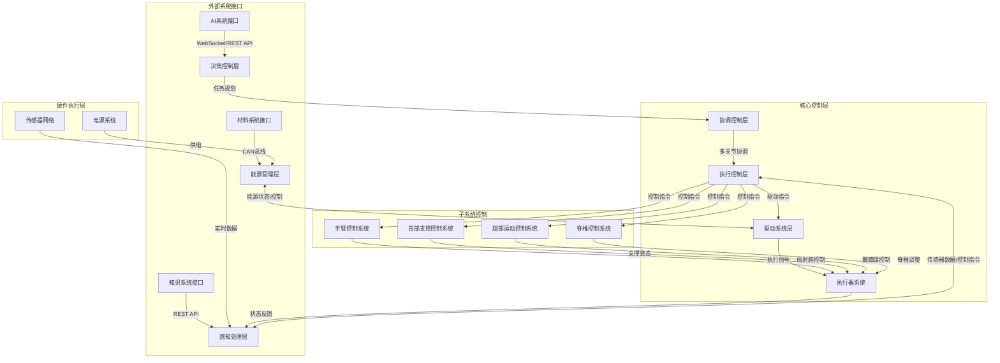
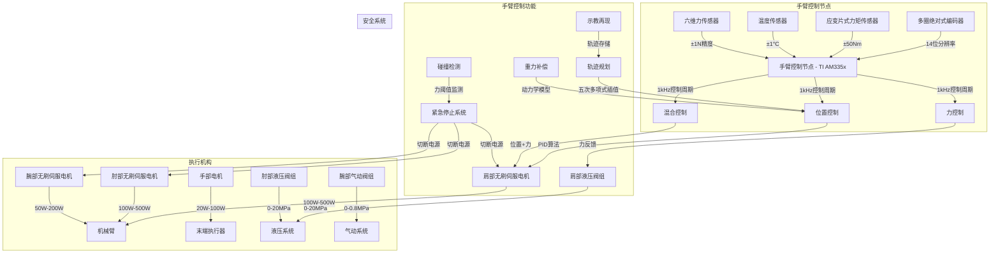
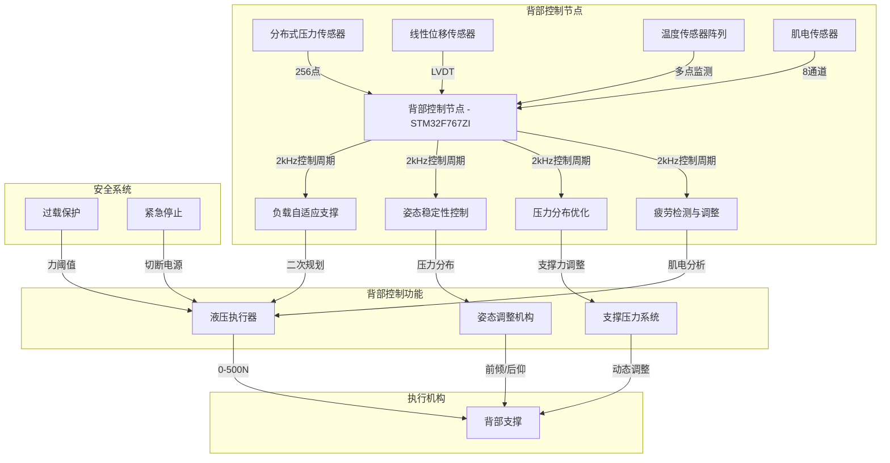
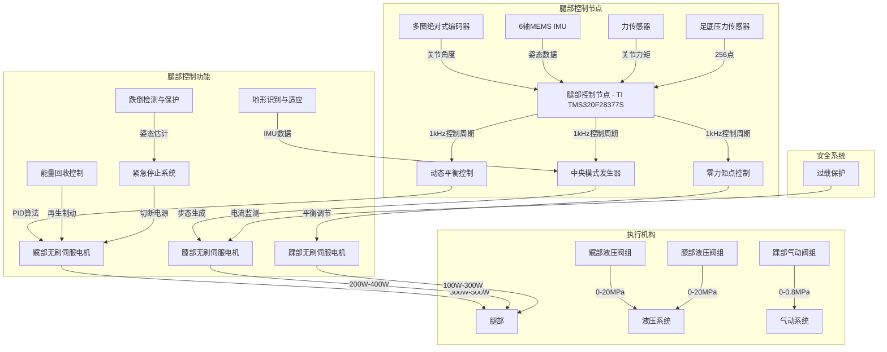
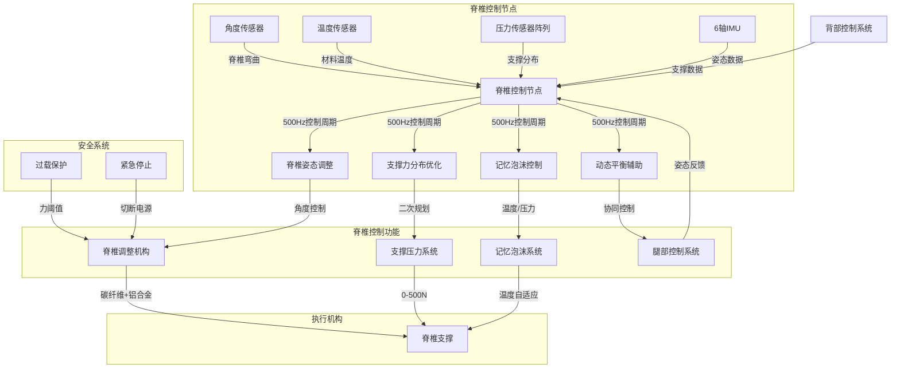
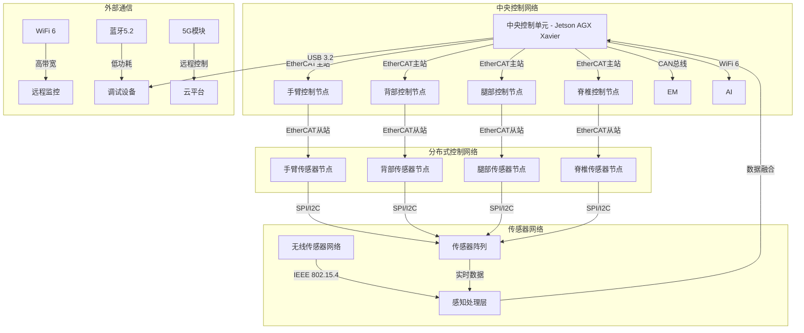
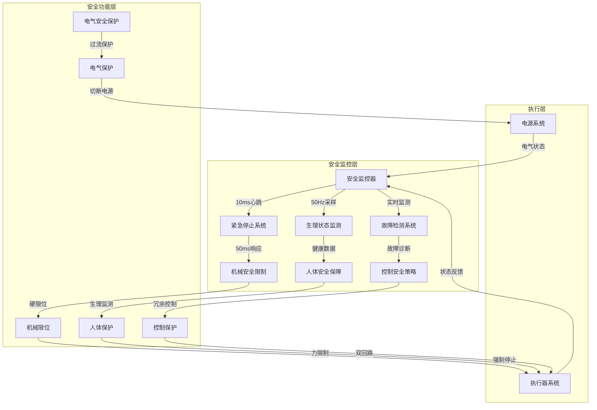

# 控制系统架构图表

## 1. 系统层次架构图

```mermaid
graph TD
    subgraph "外部系统接口"
        AI[AI系统接口] -->|WebSocket/REST API| DC
        KS[知识系统接口] -->|REST API| SP
        MS[材料系统接口] -->|CAN总线| EM
    end

    subgraph "核心控制层"
        DC[决策控制层] -->|任务规划| CC
        CC[协调控制层] -->|多关节协调| EC
        SP[感知处理层] <-->|传感器数据/控制指令| EC
        EC[执行控制层] -->|驱动指令| DS
        EM[能源管理层] <-->|能源状态/控制| DS
        DS[驱动系统层] -->|执行信号| Actuators
    end

    subgraph "子系统控制"
        ACS[手臂控制系统] -->|肩肘腕控制| Actuators
        BCS[背部支撑控制系统] -->|支撑姿态| Actuators
        LCS[腿部运动控制系统] -->|髋膝踝控制| Actuators
        SCS[脊椎控制系统] -->|脊椎调整| Actuators
    end

    subgraph "硬件执行层"
        Sensors[传感器网络] -->|实时数据| SP
        Actuators[执行器系统] -->|状态反馈| SP
        Power[电源系统] -->|供电| EM
    end

    EC -->|控制指令| ACS
    EC -->|控制指令| BCS
    EC -->|控制指令| LCS
    EC -->|控制指令| SCS
```

## 2. 手臂控制系统架构图

```mermaid
graph TD
    subgraph "手臂控制节点"
        ACN[手臂控制节点 - TI AM335x] -->|1kHz控制周期| PC
        ACN -->|1kHz控制周期| FC
        ACN -->|1kHz控制周期| HC
        
        AI[多圈绝对式编码器] -->|14位分辨率| ACN
        FT[应变片式力矩传感器] -->|±50Nm| ACN
        TC[温度传感器] -->|±1°C| ACN
        FS[六维力传感器] -->|±1N精度| ACN
    end

    subgraph "手臂控制功能"
        PC[位置控制] -->|PID算法| SMA
        FC[力控制] -->|力反馈| SMV
        HC[混合控制] -->|位置+力| SMA
        TT[示教再现] -->|轨迹存储| TP
        TP[轨迹规划] -->|五次多项式插值| PC
        GC[重力补偿] -->|动力学模型| PC
        CC[碰撞检测] -->|力阈值监测| ESS
    end

    subgraph "执行机构"
        SMA[肩部无刷伺服电机] -->|100W-500W| 机械臂
        EMA[肘部无刷伺服电机] -->|100W-500W| 机械臂
        WMA[腕部无刷伺服电机] -->|50W-200W| 机械臂
        HMA[手部电机] -->|20W-100W| 末端执行器
        SMV[肩部液压阀组] -->|0-20MPa| 液压系统
        EMV[肘部液压阀组] -->|0-20MPa| 液压系统
        WMV[腕部气动阀组] -->|0-0.8MPa| 气动系统
    end

    subgraph "安全系统"
        ESS[紧急停止系统] -->|切断电源| SMA
        ESS -->|切断电源| EMA
        ESS -->|切断电源| WMA
    end
```

## 3. 背部支撑控制系统架构图

```mermaid
graph TD
    subgraph "背部控制节点"
        BCN[背部控制节点 - STM32F767ZI] -->|2kHz控制周期| LAC
        BCN -->|2kHz控制周期| ASC
        BCN -->|2kHz控制周期| PDO
        BCN -->|2kHz控制周期| FDT
        
        PS[分布式压力传感器] -->|256点| BCN
        LS[线性位移传感器] -->|LVDT| BCN
        TS[温度传感器阵列] -->|多点监测| BCN
        EMG[肌电传感器] -->|8通道| BCN
    end

    subgraph "背部控制功能"
        LAC[负载自适应支撑] -->|二次规划| HPC
        ASC[姿态稳定性控制] -->|压力分布| SMS
        PDO[压力分布优化] -->|支撑力调整| SPS
        FDT[疲劳检测与调整] -->|肌电分析| HPC
    end

    subgraph "执行机构"
        HPC[液压执行器] -->|0-500N| 背部支撑
        SPS[支撑压力系统] -->|动态调整| 背部支撑
        SMS[姿态调整机构] -->|前倾/后仰| 背部支撑
    end

    subgraph "安全系统"
        OLP[过载保护] -->|力阈值| HPC
        ESS[紧急停止] -->|切断电源| HPC
    end
```

## 4. 腿部运动控制系统架构图

```mermaid
graph TD
    subgraph "腿部控制节点"
        LCN[腿部控制节点 - TI TMS320F28377S] -->|1kHz控制周期| DBC
        LCN -->|1kHz控制周期| CPG
        LCN -->|1kHz控制周期| ZMP
        
        AI[多圈绝对式编码器] -->|关节角度| LCN
        IMU[6轴MEMS IMU] -->|姿态数据| LCN
        FS[力传感器] -->|关节力矩| LCN
        PS[足底压力传感器] -->|256点| LCN
    end

    subgraph "腿部控制功能"
        DBC[动态平衡控制] -->|PID算法| HMA
        TRA[地形识别与适应] -->|IMU数据| CPG
        ERC[能量回收控制] -->|再生制动| HMA
        FDP[跌倒检测与保护] -->|姿态估计| ESS
        CPG[中央模式发生器] -->|步态生成| KMA
        ZMP[零力矩点控制] -->|平衡调节| AMA
    end

    subgraph "执行机构"
        HMA[髋部无刷伺服电机] -->|300W-500W| 腿部
        KMA[膝部无刷伺服电机] -->|200W-400W| 腿部
        AMA[踝部无刷伺服电机] -->|100W-300W| 腿部
        HMV[髋部液压阀组] -->|0-20MPa| 液压系统
        KMV[膝部液压阀组] -->|0-20MPa| 液压系统
        AMV[踝部气动阀组] -->|0-0.8MPa| 气动系统
    end

    subgraph "安全系统"
        ESS[紧急停止系统] -->|切断电源| HMA
        OLP[过载保护] -->|电流监测| KMA
    end
```

## 5. 脊椎控制系统架构图

```mermaid
graph TD
    subgraph "脊椎控制节点"
        SCN[脊椎控制节点] -->|500Hz控制周期| SPA
        SCN -->|500Hz控制周期| PDO
        SCN -->|500Hz控制周期| MFC
        SCN -->|500Hz控制周期| DBA
        
        AS[角度传感器] -->|脊椎弯曲| SCN
        TS[温度传感器] -->|材料温度| SCN
        PS[压力传感器阵列] -->|支撑分布| SCN
        IMU[6轴IMU] -->|姿态数据| SCN
    end

    subgraph "脊椎控制功能"
        SPA[脊椎姿态调整] -->|角度控制| SAS
        PDO[支撑力分布优化] -->|二次规划| SPS
        MFC[记忆泡沫控制] -->|温度/压力| MFS
        DBA[动态平衡辅助] -->|协同控制| LCS
    end

    subgraph "执行机构"
        SAS[脊椎调整机构] -->|碳纤维+铝合金| 脊椎支撑
        SPS[支撑压力系统] -->|0-500N| 脊椎支撑
        MFS[记忆泡沫系统] -->|温度自适应| 脊椎支撑
    end

    subgraph "安全系统"
        OLP[过载保护] -->|力阈值| SAS
        ESS[紧急停止] -->|切断电源| SAS
    end

    LCS[腿部控制系统] -->|姿态反馈| SCN
    BCS[背部控制系统] -->|支撑数据| SCN
```

## 6. 通信网络架构图

```mermaid
graph TD
    subgraph "中央控制网络"
        CCU[中央控制单元 - Jetson AGX Xavier] -->|EtherCAT主站| ACN
        CCU -->|EtherCAT主站| BCN
        CCU -->|EtherCAT主站| LCN
        CCU -->|EtherCAT主站| SCN
        CCU -->|CAN总线| EM
        CCU -->|WiFi 6| AI
    end

    subgraph "分布式控制网络"
        ACN[手臂控制节点] -->|EtherCAT从站| SN1
        BCN[背部控制节点] -->|EtherCAT从站| SN2
        LCN[腿部控制节点] -->|EtherCAT从站| SN3
        SCN[脊椎控制节点] -->|EtherCAT从站| SN4
    end

    subgraph "传感器网络"
        SN1[手臂传感器节点] -->|SPI/I2C| Sensors
        SN2[背部传感器节点] -->|SPI/I2C| Sensors
        SN3[腿部传感器节点] -->|SPI/I2C| Sensors
        SN4[脊椎传感器节点] -->|SPI/I2C| Sensors
        WSN[无线传感器网络] -->|IEEE 802.15.4| SP
    end

    subgraph "外部通信"
        WiFi[WiFi 6] -->|高带宽| 远程监控
        BT[蓝牙5.2] -->|低功耗| 调试设备
        5G[5G模块] -->|远程控制| 云平台
    end

    CCU -->|USB 3.2| 调试设备
    Sensors[传感器阵列] -->|实时数据| SP
    SP[感知处理层] -->|数据融合| CCU
```

## 7. 安全机制架构图

```mermaid
graph TD
    subgraph "安全监控层"
        SM[安全监控器] -->|10ms心跳| ESS
        SM -->|实时监测| FDS
        SM -->|50Hz采样| PTS
        ESS[紧急停止系统] -->|50ms响应| MSL
        FDS[故障检测系统] -->|故障诊断| CSL
        PTS[生理状态监测] -->|健康数据| HSL
    end

    subgraph "安全功能层"
        MSL[机械安全限制] -->|硬限位| ML
        ESL[电气安全保护] -->|过流保护| EL
        HSL[人体安全保障] -->|生理监测| HL
        CSL[控制安全策略] -->|冗余控制| CL
    end

    subgraph "执行层"
        ML[机械限位] -->|强制停止| Actuators
        EL[电气保护] -->|切断电源| Power
        HL[人体保护] -->|力限制| Actuators
        CL[控制保护] -->|双回路| Actuators
    end

    Actuators[执行器系统] -->|状态反馈| SM
    Power[电源系统] -->|电气状态| SM
```