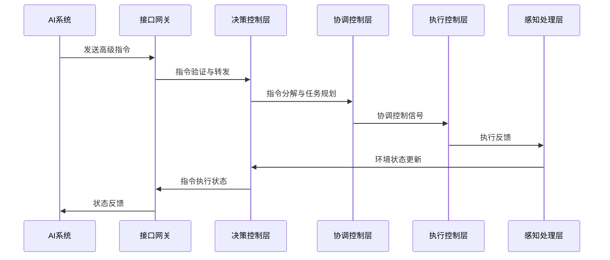

# 控制系统与AI系统集成设计文档

## 1. 概述

本文档详细说明人体外骨骼机器控制系统与AI系统的集成方案，包括接口定义、数据交换协议、协同工作机制以及智能控制策略等内容，确保两个系统能够高效协同工作，为人体外骨骼提供智能化控制能力。

## 2. 集成架构

### 2.1 整体集成架构

```
+----------------+     +------------------+     +------------------+
|                |     |                  |     |                  |
|   AI系统接口   |---->|    决策控制层    |---->|    协调控制层    |
|                |     |                  |     |                  |
+----------------+     +------------------+     +------------------+
                                                     |
                                                     v
+----------------+     +------------------+     +------------------+
|                |     |                  |     |                  |
|  知识系统接口  |---->|    感知处理层    |<--->|    执行控制层    |
|                |     |                  |     |                  |
+----------------+     +------------------+     +------------------+
                                                     |
                                                     v
+----------------+     +------------------+     +------------------+
|                |     |                  |     |                  |
|  材料系统接口  |---->|    能源管理层    |<--->|    驱动系统层    |
|                |     |                  |     |                  |
+----------------+     +------------------+     +------------------+
```

### 2.2 集成层次说明

#### 2.2.1 系统接口层
- **功能**：建立AI系统与控制系统之间的通信桥梁
- **关键组件**：API网关、协议转换器、数据验证器
- **技术特点**：采用RESTful API与WebSocket混合架构，确保实时性和可靠性

#### 2.2.2 决策协同层
- **功能**：AI系统与控制系统决策机制的协同
- **关键组件**：决策融合器、优先级管理器、冲突解决器
- **技术特点**：基于多智能体系统的协同决策机制

#### 2.2.3 数据交换层
- **功能**：确保两个系统间数据的高效、安全传输
- **关键组件**：数据序列化器、加密模块、缓存管理器
- **技术特点**：采用Protobuf序列化，AES-256加密传输

#### 2.2.4 控制策略层
- **功能**：整合AI算法与控制算法，形成智能控制策略
- **关键组件**：策略选择器、参数优化器、学习模块
- **技术特点**：自适应策略调整，在线学习能力

## 3. 接口定义

### 3.1 AI系统到控制系统接口

#### 3.1.1 高级指令接口
- **接口类型**：RESTful API
- **端点**：`/api/v1/control/high_level_command`
- **方法**：POST
- **请求格式**：
  ```json
  {
    "command_id": "unique_command_id",
    "command_type": "move/grasp/balance/adjust",
    "target_position": [x, y, z],
    "target_orientation": [roll, pitch, yaw],
    "force_profile": {"max": 100, "min": 10, "rate": 5},
    "priority": 1-10,
    "time_constraint": {
      "deadline": "2023-06-01T12:00:00Z",
      "timeout": 5000
    }
  }
  ```
- **响应格式**：
  ```json
  {
    "status": "accepted/rejected/queued",
    "task_id": "task_123",
    "estimated_completion_time": 1500,
    "warnings": []
  }
  ```

#### 3.1.2 实时控制接口
- **接口类型**：WebSocket
- **端点**：`ws://control/system/realtime`
- **消息格式**：
  ```json
  {
    "message_type": "control_update",
    "timestamp": "2023-06-01T12:00:00.123Z",
    "control_data": {
      "joint_positions": [...],
      "joint_velocities": [...],
      "joint_torques": [...],
      "gains": {...}
    }
  }
  ```

#### 3.1.3 系统配置接口
- **接口类型**：RESTful API
- **端点**：`/api/v1/control/config`
- **方法**：PUT
- **请求格式**：
  ```json
  {
    "config_id": "control_params_v2",
    "control_mode": "position/force/hybrid",
    "stiffness_params": {...},
    "damping_params": {...},
    "safety_limits": {...},
    "adaptation_settings": {...}
  }
  ```

### 3.2 控制系统到AI系统接口

#### 3.2.1 状态反馈接口
- **接口类型**：WebSocket
- **端点**：`ws://ai/system/status`
- **消息格式**：
  ```json
  {
    "message_type": "system_status",
    "timestamp": "2023-06-01T12:00:00.123Z",
    "system_state": {
      "joint_positions": [...],
      "joint_velocities": [...],
      "joint_torques": [...],
      "battery_level": 85,
      "temperature": 35.5,
      "error_codes": [],
      "task_progress": 75
    }
  }
  ```

#### 3.2.2 环境感知数据接口
- **接口类型**：RESTful API
- **端点**：`/api/v1/ai/environment_data`
- **方法**：POST
- **请求格式**：
  ```json
  {
    "sensor_id": "env_sensor_01",
    "timestamp": "2023-06-01T12:00:00.123Z",
    "data_type": "force/temperature/proximity",
    "sensor_data": [...],
    "metadata": {...}
  }
  ```

#### 3.2.3 任务完成通知接口
- **接口类型**：RESTful API
- **端点**：`/api/v1/ai/task_completion`
- **方法**：POST
- **请求格式**：
  ```json
  {
    "task_id": "task_123",
    "completion_status": "success/failed/cancelled",
    "timestamp": "2023-06-01T12:00:05.456Z",
    "execution_metrics": {
      "duration": 5432,
      "accuracy": 0.95,
      "energy_consumed": 1200
    },
    "errors": [],
    "recommendations": []
  }
  ```

## 4. 数据交换协议

### 4.1 通信协议选择

#### 4.1.1 有线通信
- **主要协议**：EtherCAT
  - 特性：实时性高，确定性好，支持分布式控制
  - 应用场景：控制系统内部通信，关键控制信号传输
- **辅助协议**：Ethernet TCP/IP
  - 特性：通用性强，开发便捷
  - 应用场景：配置数据传输，日志同步

#### 4.1.2 无线通信
- **主要协议**：WiFi 6 (802.11ax)
  - 特性：高带宽，低延迟
  - 应用场景：与AI系统的主要通信方式
- **辅助协议**：Bluetooth 5.2
  - 特性：低功耗，安全性好
  - 应用场景：近距离调试，状态监控

### 4.2 数据序列化与编码

- **序列化格式**：Protobuf
  - 优势：紧凑的数据表示，快速解析，强类型检查
  - 应用场景：所有系统间通信数据

- **编码标准**：
  - 数值数据：IEEE 754浮点数
  - 角度数据：弧度制
  - 位置数据：米制
  - 力/力矩数据：牛顿/牛顿米

### 4.3 数据安全机制

- **传输加密**：
  - 有线通信：TLS 1.3
  - 无线通信：WPA3 + TLS 1.3

- **认证机制**：
  - 双向TLS认证(mTLS)
  - API密钥 + 令牌认证
  - 设备证书验证

- **数据完整性**：
  - CRC32校验
  - 消息摘要验证

## 5. 协同工作机制

### 5.1 控制指令处理流程



### 5.2 决策优先级机制

- **优先级分级**：
  - 紧急优先级（P0）：安全相关指令，立即执行
  - 高优先级（P1）：用户直接操作指令
  - 中优先级（P2）：AI系统自动优化指令
  - 低优先级（P3）：维护和诊断任务

- **冲突解决策略**：
  - 时间约束优先：接近截止时间的任务优先
  - 安全优先：任何可能影响安全的操作优先处理
  - 资源利用率优先：优化系统资源使用效率
  - 可中断性策略：允许高优先级任务中断低优先级任务

### 5.3 同步与协调机制

- **时间同步**：
  - IEEE 1588 PTP协议实现微秒级时间同步
  - 主从时钟架构，中央控制单元作为主时钟

- **动作协调**：
  - 基于事件的同步模型
  - 预测性协调算法，提前规划协同动作
  - 容错机制，处理部分节点延迟或故障

### 5.4 异常处理机制

- **错误检测**：
  - 多级别错误检测（语法、语义、执行）
  - 超时监控机制
  - 异常模式识别

- **错误恢复策略**：
  - 指令重传机制
  - 备用路径切换
  - 降级运行模式
  - 安全停机程序

## 6. 智能控制策略

### 6.1 AI增强的控制算法

#### 6.1.1 自适应控制增强
- **传统自适应控制**：基于数学模型的参数调整
- **AI增强**：利用深度学习预测系统动态特性，提前调整参数
- **实现方式**：神经网络与模型参考自适应控制结合

#### 6.1.2 预测控制优化
- **传统预测控制**：有限时域优化，固定预测模型
- **AI增强**：动态调整预测窗口，自适应模型更新
- **实现方式**：强化学习优化预测控制器参数

#### 6.1.3 智能轨迹规划
- **传统轨迹规划**：预定义轨迹库，简单插值
- **AI增强**：基于环境和用户意图的动态轨迹生成
- **实现方式**：生成式模型结合运动学约束

### 6.2 学习与优化机制

#### 6.2.1 在线学习系统
- **学习目标**：优化控制参数，适应用户习惯
- **学习算法**：增量学习，在线梯度下降
- **触发条件**：性能偏差，用户反馈，环境变化

#### 6.2.2 用户适应性学习
- **学习内容**：用户运动模式，力量特性，操作习惯
- **学习方法**：监督学习 + 强化学习
- **个性化模型**：为不同用户维护定制控制模型

#### 6.2.3 性能优化框架
- **优化指标**：能源效率，响应速度，精确度，舒适度
- **优化算法**：多目标优化，进化算法
- **优化周期**：实时优化，定期深度优化

### 6.3 决策支持系统

#### 6.3.1 场景识别
- **功能**：识别当前工作场景（行走、搬运、攀爬等）
- **实现**：深度学习分类模型，多传感器融合
- **应用**：自动切换控制策略和参数

#### 6.3.2 风险评估
- **功能**：预测潜在风险和故障
- **实现**：异常检测算法，预测性维护模型
- **应用**：预防性调整，提前预警

#### 6.3.3 辅助决策
- **功能**：为控制系统提供决策建议
- **实现**：专家系统，贝叶斯网络
- **应用**：复杂场景下的最优控制策略选择

## 7. 集成测试方案

### 7.1 接口测试

- **测试内容**：
  - 接口响应时间测试
  - 数据格式验证测试
  - 错误处理测试
  - 负载测试

- **测试工具**：
  - API测试工具：Postman, JMeter
  - 自动化测试框架：pytest, Jest
  - 性能监控工具：Prometheus, Grafana

### 7.2 功能测试

- **测试场景**：
  - 基本运动控制测试
  - 复杂任务执行测试
  - 紧急情况响应测试
  - 用户交互测试

- **测试方法**：
  - 模拟环境测试
  - 半实物仿真测试
  - 实机测试
  - 用户体验测试

### 7.3 性能测试

- **测试指标**：
  - 端到端延迟：<10ms
  - 吞吐量：>1000指令/秒
  - 系统稳定性：连续运行>24小时无故障
  - 资源利用率：CPU<70%，内存<80%

- **测试环境**：
  - 实验室环境
  - 模拟真实使用环境
  - 极限条件测试环境

### 7.4 安全测试

- **测试内容**：
  - 数据加密测试
  - 认证授权测试
  - 渗透测试
  - 安全边界测试

- **测试方法**：
  - 安全审计
  - 漏洞扫描
  - 模糊测试
  - 红队测试

## 8. 安全与性能保障机制

### 8.1 安全保障机制

#### 8.1.1 通信安全
- **多层次防护**：网络层、传输层、应用层安全
- **安全协议**：TLS 1.3，WPA3
- **防攻击措施**：DDoS防护，入侵检测系统

#### 8.1.2 数据安全
- **数据分类**：敏感数据、普通数据分级保护
- **存储安全**：加密存储，访问控制
- **数据脱敏**：传输和存储过程中的数据脱敏

#### 8.1.3 系统安全
- **安全启动**：硬件安全模块，安全启动流程
- **权限管理**：最小权限原则，基于角色的访问控制
- **安全更新**：加密更新通道，版本验证

### 8.2 性能保障机制

#### 8.2.1 实时性保障
- **优先级调度**：实时操作系统，优先级调度算法
- **资源预留**：关键任务资源预留
- **负载均衡**：分布式负载均衡

#### 8.2.2 可靠性保障
- **冗余设计**：关键组件冗余，备份系统
- **容错机制**：错误检测与自动恢复
- **降级运行**：部分功能故障时的降级运行模式

#### 8.2.3 可扩展性保障
- **模块化设计**：松耦合架构，插件式组件
- **接口标准化**：标准接口定义，向后兼容
- **动态配置**：运行时配置调整，无需重启

## 9. 实施计划

### 9.1 阶段一：接口开发与测试
- **任务**：开发API接口，实现基本通信
- **时间**：3周
- **交付物**：接口规范文档，API实现代码，测试报告

### 9.2 阶段二：集成框架实现
- **任务**：实现数据交换层，协同工作机制
- **时间**：4周
- **交付物**：集成框架代码，配置管理系统，初步集成测试报告

### 9.3 阶段三：智能控制策略实现
- **任务**：实现AI增强控制算法，学习优化机制
- **时间**：5周
- **交付物**：智能控制算法实现，学习系统，性能评估报告

### 9.4 阶段四：系统测试与优化
- **任务**：全面测试，性能优化，问题修复
- **时间**：4周
- **交付物**：完整测试报告，优化后的系统，部署文档

## 10. 结论与建议

本文档详细定义了人体外骨骼机器控制系统与AI系统的集成方案，包括接口定义、数据交换协议、协同工作机制以及智能控制策略。该集成方案具备高性能、高可靠性和高安全性的特点，能够满足人体外骨骼机器的复杂控制需求，实现智能化、个性化的用户体验。

### 10.1 后续建议
- 建立持续集成/持续部署(CI/CD)流程
- 制定定期性能评估和优化计划
- 建立知识库，积累系统运行经验
- 开发更先进的AI模型，提升系统智能化水平
- 建立用户反馈机制，持续改进系统